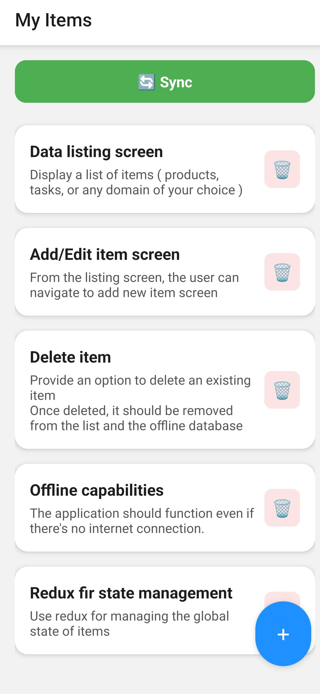
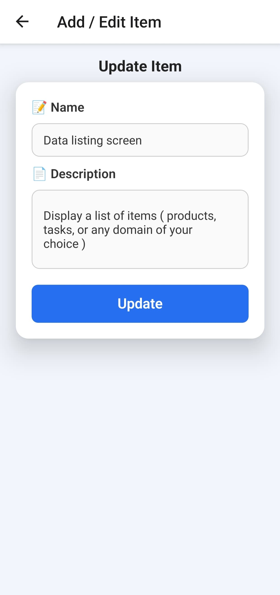
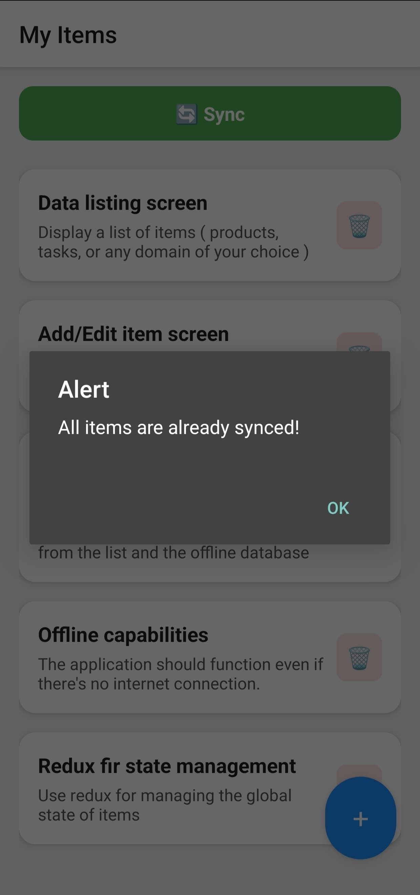
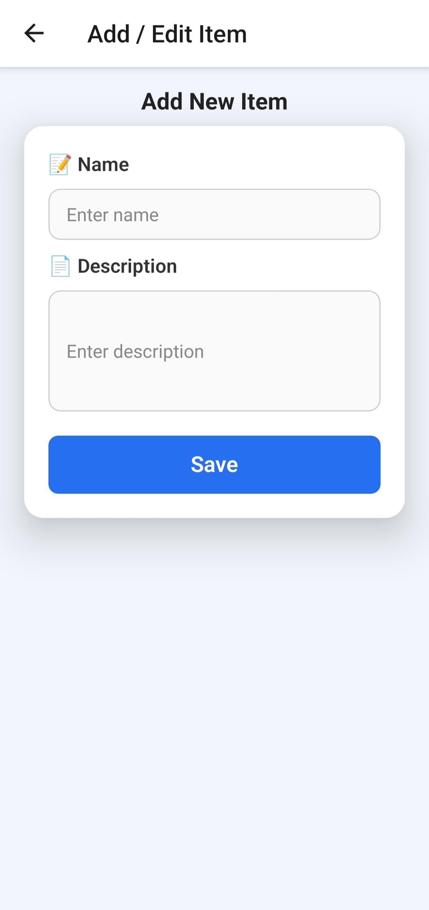
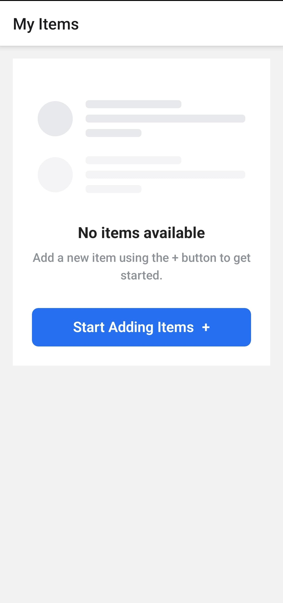

# 📱 Offline CRUD App (React Native)

This is a small mobile application built using **React Native (CLI)** and **Redux** to demonstrate:

- Offline data storage and retrieval using **SQLite**
- Global state management with **Redux**
- Basic **CRUD operations** (Create, Read, Update, Delete)
- Optional syncing logic to simulate server integration

---

## 🚀 Features

- ✅ Offline-first architecture with SQLite database
- ✅ Add, edit, delete items (e.g., notes/tasks)
- ✅ Redux for managing global state
- ✅ Form validations using **Formik + Yup**
- ✅ Sync unsynced items to a mock remote server (optional bonus feature)
- ✅ Polished UI with toasts and confirmations for better UX

---

## 📂 Folder Structure

/src /components → Reusable UI components (like EmptyState, ItemForm) /redux → Redux store, actions, reducers /screens → Main screens: ItemList, AddEditItem /services → Database logic (SQLite CRUD & sync helpers) App.js → Navigation setup

## 🛠️ Tech Stack

- **React Native CLI (v0.79.0)**
- **Redux** (vanilla, no Toolkit)
- **SQLite** (`react-native-sqlite-storage`)
- **Formik** + **Yup** (form handling & validation)
- Android tested ✅

---

## 🧪 How to Run

1. Clone the repo:
   ```bash
   git clone https://github.com/shivamarora08/OfflineCRUDApp.git
   cd OfflineCRUDApp

   Install dependencies:
    npm install

2. Run on Android:
    npx react-native run-android

💡 If you're using a physical device, make sure USB debugging is on.

Sync Feature (Optional)
If you're connected to the internet and want to simulate syncing:

Add some new items (they'll be marked as synced = 0).

Press the Sync button in the Item List screen.

Items will be marked as "synced" locally after a fake API call.

ℹ️ Syncing is handled via SQLite and updates synced flag after a delay (no real backend used).

## 📸 Screenshots

### 🏠 Item List Screen


### ✏️ Update Item Screen


### 🔄 Sync Alert


### ➕ Add Item Screen


### 📭 Empty State


## 🧪 Demo

